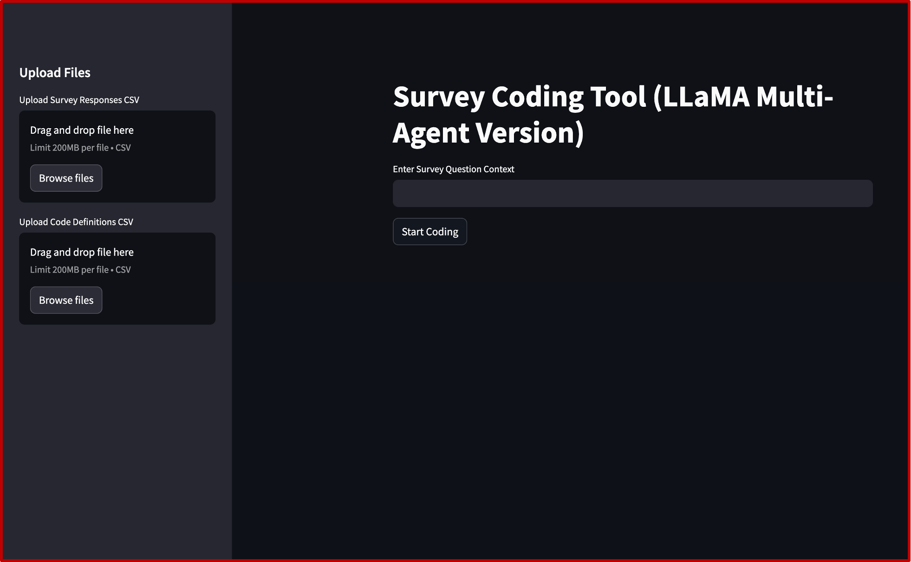
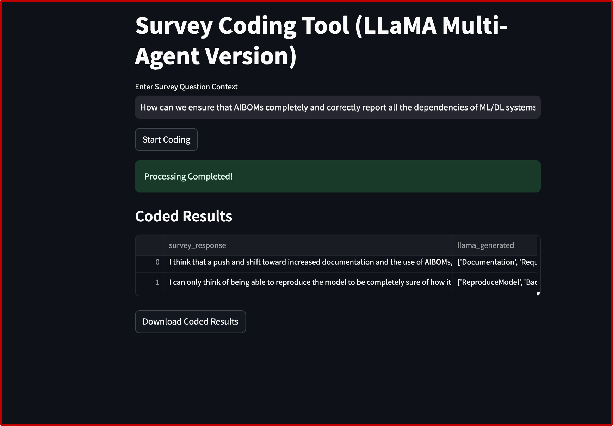

# 🔍 LLM for Close Coding
LLM for Close Coding is a research tool designed to automate the qualitative analysis process by assigning predefined codes to open-ended survey responses using Large Language Models (LLMs). It reduces the time and effort required for manual coding while improving consistency and scalability.

# 📌 Project Description
In qualitative research, close coding involves tagging textual responses with predefined categories based on a codebook. This project uses state-of-the-art LLMs (e.g., LlaMa) to replicate this process automatically. Our system also supports multi-agent validation, model agreement analysis, and error checking. We also create a webpage where user can upload the survey response, the code and definition as a csv file.

# How to replicate

1. Navigate to your project folder
```
cd your_project_directory
```
2. Create the virtual environment
```
python -m venv .venv
```
3. Activate the virtual environment
```
source .venv/bin/activate
```
4. Install dependencis
```
pip install -r requirements.txt
```

# 📚 Uploading your own survey...
If you want to upload your own survey dataset. Then, make sure your survey is in a single csv file and your code and code definiion is also another csv file you can upload it by clicking the upload button.


# Streamlit
We use streamlit for uploading and the interactions. If you want to run the app.py file then:

```
streamlit run main.py
```


# Webpage of uploading survey



